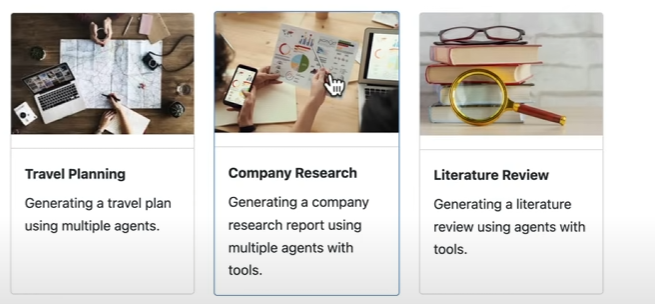

# Autogen Crash Course Projects



[](https://www.python.org/downloads/)
[](https://github.com/microsoft/autogen)
[](https://opensource.org/licenses/MIT)

A collection of advanced AI agent applications built using Microsoft's AutoGen framework. This repository contains multiple projects demonstrating the power of agent-based AI applications.

## 📚 Projects

### 🧠 AlgoGenie - DSA Problem Solver

AlgoGenie is an intelligent agent-based system designed to solve Data Structures and Algorithms (DSA) problems. The system uses a team of specialized agents:

- **DSA Problem Solver Agent**: Analyzes problems, develops solutions, and writes code
- **Code Executor Agent**: Executes code safely in a Docker container

#### Key Features:

- Interactive Streamlit UI
- Docker-based code execution for security
- Step-by-step solution explanations
- Automatic code saving and testing

### 📝 Literature Review Agent

An AI assistant that helps researchers by automating literature reviews on academic topics:

- Searches arXiv for relevant papers
- Summarizes key findings
- Creates a formatted literature review

#### Key Features:

- Custom arXiv search integration
- Paper filtering and relevance ranking
- Markdown-formatted literature reviews
- Streamlit UI for easy interaction

## 🚀 Installation

1. Clone the repository:

```bash
git clone https://github.com/yourusername/autogen-crash.git
cd autogen-crash
```

2. Install dependencies:

```bash
pip install -r requirements.txt
```

3. Set up environment variables:
   Create a `.env` file in the root directory with the following:

```env
# Example environment variables
OPENAI_API_KEY=your_openai_api_key
ARXIV_API_KEY=your_arxiv_api_key
```

4. Run the application:

```bash
streamlit run app.py
```

## 🤝 Contributing

Contributions are welcome! Please read our [contributing guidelines](CONTRIBUTING.md) for more information.

## 📄 License

This project is licensed under the MIT License - see the [LICENSE](LICENSE) file for details.

## 📞 Contact

For questions or feedback, please reach out to [your.email@example.com](mailto:your.email@example.com).

---

Enjoy exploring the world of AI agents with AutoGen!
